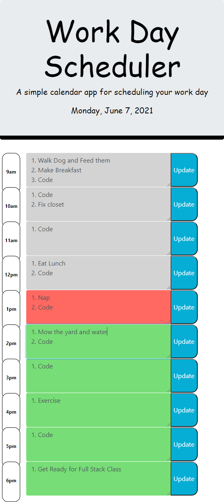

# Day Scheduler
Day Scheduler

# Working Files
HTML,CSS Files: https://github.com/gmcmurray/DayScheduler

Deployed Application: https://gmcmurray.github.io/DayScheduler/

## Description 

Day Scheduler application provides a daily planner for a workday starting at 9am to 6pm.
Provides a userinput to enter toDos in each hour slot and is saved in localMemory so
that toDos are preserved during page reload.  Time slots are color coded background with past the
present hour (grey), present hour (red) and future (green).

## Skills and Coding Features
JQuery external library was used along with third party API's: Google Fonts, Moment and BootStrap were used to create this dynamic web application.  BootStrap provided some ready made multi-line input forms
with buttons which sped up development nd deployment of this API.  JQuery also was handy as it reduced
the lines of code required.  Finally the back tick technique was used, along with ${} to access variables.  This back tick method was very useful in creating HTML text.

## Screen Shots
Screen shots with width of 550 pixels below.

Page 1 - Main Page
